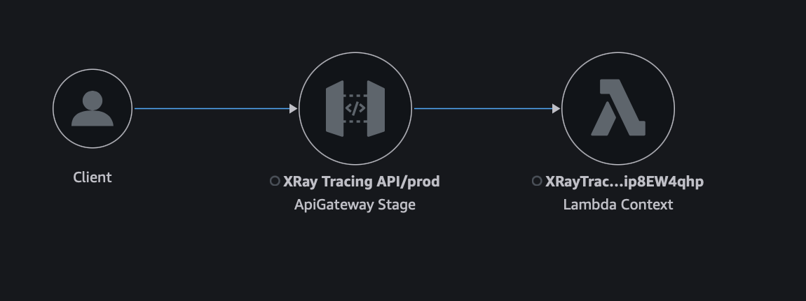
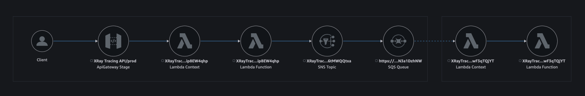
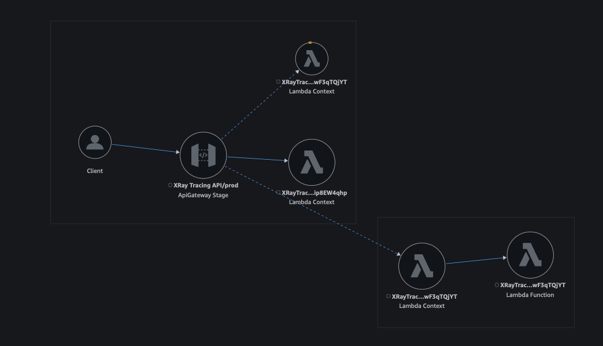

# AWS X-Ray Trace Analysis

## Overview

This document provides a comprehensive analysis of X-Ray trace results for various AWS service configurations, focusing on API Gateway, Lambda functions, and SNS integration patterns. Each scenario demonstrates different tracing configurations and their impact on observability.

## Trace Scenarios

### Scenario 1: Basic API Gateway Configuration

- API Gateway: Active tracing enabled
- No additional services configured

### Scenario 2: API Gateway with Producer Lambda (Passthrough)

- API Gateway: Active tracing enabled
- Producer Lambda: IAM policy configured
- Lambda: Tracing set to Passthrough

### Scenario 3: API Gateway with Producer Lambda (Active)

- API Gateway: Active tracing enabled
- Producer Lambda: IAM policy configured
- Lambda: Active tracing enabled

### Scenario 4: API Gateway with Producer Lambda (Active)

- API Gateway: Active tracing enabled
- Producer Lambda: IAM policy configured
- Lambda: Active tracing enabled
- SNS: Resource policy configured

### Scenario 5: API Gateway with Producer Lambda and SNS

- API Gateway: Active tracing enabled
- Producer Lambda: IAM policy configured
- Lambda: Active tracing enabled
- SNS: Active tracing enabled

### Scenario 6: Full Integration with Consumer Lambda (Inactive)

- API Gateway: Active tracing enabled
- Producer Lambda: IAM policy configured
- Producer Lambda: Active tracing enabled
- SNS: Active tracing enabled
- Consumer Lambda: IAM policy configured
- Consumer Lambda: Tracing inactive

### Scenario 7: Full Integration with Active Consumer Lambda

- API Gateway: Active tracing enabled
- Producer Lambda: IAM policy configured
- Producer Lambda: Active tracing enabled
- SNS: Active tracing enabled
- Consumer Lambda: IAM policy configured
- Consumer Lambda: Active tracing enabled

### Scenario 8: Producer Passthrough with Active Consumer

- API Gateway: Active tracing enabled
- Producer Lambda: IAM policy configured
- Producer Lambda: Tracing set to Passthrough
- SNS: Active tracing enabled
- Consumer Lambda: IAM policy configured
- Consumer Lambda: Active tracing enabled

### Scenario 9: Producer and SNS Passthrough

- API Gateway: Active tracing enabled
- Producer Lambda: IAM policy configured
- Producer Lambda: Tracing set to Passthrough
- SNS: Tracing set to Passthrough
- Consumer Lambda: IAM policy configured
- Consumer Lambda: Active tracing enabled

## Conclusion

This analysis demonstrates the impact of different tracing configurations across various AWS services. The scenarios progress from basic API Gateway tracing to complex multi-service integrations, showing how different tracing settings affect the visibility of service interactions and performance metrics.
